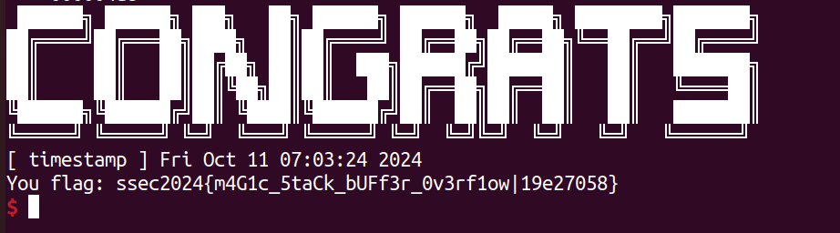
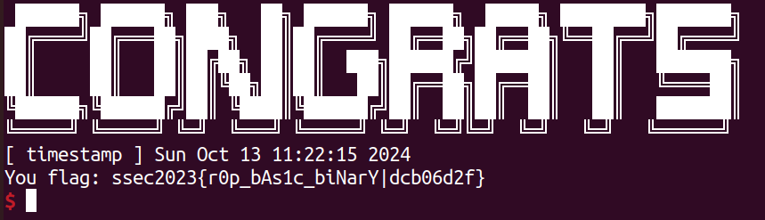
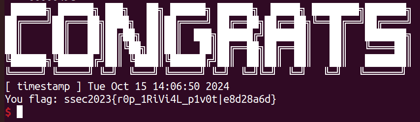

# lab1

为顺利完成此次作业，你需要掌握：

1. ELF 程序的内存布局（memory layout）
2. x64/86 架构下程序的栈帧结构，数组型变量在栈上的存储
3. x64/86 架构下的程序汇编

如若自我感觉并没有很熟悉，请回顾课上内容，也可以拓展阅读下列资料：

- [CTF wiki pwn](https://ctf-wiki.org/pwn/linux/user-mode/stackoverflow/x86/stack-intro/)
- [pwn 基础导论](https://github.com/team-s2/ctf_summer_courses/blob/main/slides/pwn/01_pwn.pdf)

> 请按照如下所述要求撰写实验报告，保证报告包含下述的得分点，报告不限格式，请将最终的报告提交于学在浙大上

### 1 栈上缓冲区溢出 (40 points)


> 请查看仓库目录 `lab-01/sbof`

#### 示例

请阅读 `sbof1.c` 和 `example.py`，关注脚本中：

- 学会使用 pwntools 中的 `ELF`，其可以方便的辅助得到代码下符号的地址、字符串地址、GOT 表等信息
- 学会根据读汇编代码理解如何计算缓冲区长度以及如何覆盖返回地址的

#### 实践

请阅读 `sbof2.c`，并在理解 `example.py` 的基础上编写攻击代码，实现 `ret2shellcode` 攻击的本地测试和远程测试，该服务暴露在：

>  IP: `8.154.20.109`, PORT: `10100`

请截图证明远程成功拿 shell，并将攻击代码以附件形式提交 (下图为获取到 flag 的截图示例)


> 注：shellcode 可以通过 pwntools 的 `shellcraft` 库生成，或者查看 [shell-strom 网站](https://shell-storm.org/shellcode/index.html)

!!! hint
	[ret2shellcode - CTF Wiki](https://ctf-wiki.org/pwn/linux/user-mode/stackoverflow/x86/basic-rop/#ret2shellcode)

!!! done "Solution"
	根据题目中的提示，可以知道本题可以使用ret2shellcode进行攻击，首先在`lab-01/sbof`地址下利用checksec检测一下`sbof2`开启的程序保护。
	```shell linenums="1"
	sudo apt-get install checksec
	checksec --file=sbof2
	file sbof2
	```
	得到`sbof2`基本没有开启保护，并且为64位elf文件。通过查看`sbof2.c`可知存在可溢出的函数`gets`，所以可以直接写入shellcode进行栈溢出攻击。

	接下来需要确定shellcode的长度，shellcode应该覆盖gets所申请的栈大小加上存储old rbp的8位（32位程序为4位），在IDA中查看`sbof2`对应的汇编代码，得到
	```
	lea linenums="1"     rax, [rbp+var_100]
	mov     rdi, rax
	mov     eax, 0
	call    _gets
	```
	其中`var_100`的定义为 `var_100= byte ptr -100h` ，故len(shellcode)=0x100+0x8=0x108.

	将shellcode写入`buffer`后，还需要应该指令让`rip`跳到`buffer`的首地址对shellcode进行执行，所以我们接下来需要修改`rip`。

	在调用`gets`函数之后，程序通过`ret`返回调用程序的位置，`ret`相当于：`pop rip`. 我们只需要在栈顶输入shellcode的地址，便可以让程序执行gets函数结束后，执行shellcode中的指令，而shellcode的地址便是`buffer`的地址，`buffer`的地址在源程序中有输出，将源程序的字符串输出转化为数据得到`buffer_addr`。`payload=shellcode+buffer_addr`，并将payload作为`gets`的输入。

	在本地调试成功后，改变连接方式，进行远程连接，执行命令后得到flag。
	```
	ls linenums="1"
	./flag.exe 3220105848
	```
	

### 2 ROP: Return-Oriented-Programming (60 points)

> 请查看仓库目录 `lab-01/rop`

#### 示例

请阅读 `rop1.c` 和 `example.py`，关注脚本中：

- `rop1.c` 的攻击和 `rop2.c` 的攻击有何区别
- 学会使用 pwntools 的 [rop API](https://docs.pwntools.com/en/stable/rop/rop.html)，让 payload 的构造事半功倍

> 注：也可以使用 ROPGadget 等工具，更加定制化的选择 gadgets

#### 实践 - 1

请阅读 `rop2.c`，并在理解 `example.py` 的基础上编写攻击代码，实现 `ret2libc` 攻击的本地测试和远程测试，该服务暴露在：

> IP: `8.154.20.109`, PORT: `10101`

> 注：`rop2` 是静态链接的程序，请注意区别

!!! hint
	[pwn之ret2syscall](https://www.cnblogs.com/fuxuqiannian/p/16913836.html#syscall)

!!! done "Solution"
	根据题目提示使用ret2libc攻击，但似乎我并没有利用到libc，应该是ret2syscall (?) 

	同样，先在`lab-01/rop`地址下利用checksec检测一下`rop2`开启的程序保护。
	```shell linenums="1"
	checksec --file=rop2
	file rop2
	```
	得到`rop2`开启了NX保护，并且为64位elf文件。NX保护限制了数据内存页的执行，所以无法像`sbof2`一样使用ret2shellcode攻击。通过查看`sbof2.c`可知`buffer`的长度是固定的64，但`read`函数写入的长度可以自行输入，因此可以通过`read`函数进行栈溢出，而且`system`函数和`/bin/sh`字符串均存在，所以选择ret2syscall攻击。

	在ret2syscall攻击中，我们选择`execve`（在父进程中fork一个子进程，在子进程中调用`exec`函数启动新的程序），寄存器赋值如下：

	|rax|rdi|rsi|rdx|
	|:--:|:--:|:--:|:--:|
	|execve系统调用号(0x3b)|sh_addr|0|0|

	> hint: 如果是32位，则寄存器依次位`eax` `ebx` `ecx` `edx` ，并且`execve`系统调用号为0x0b。

	这时，寄存器的赋值便需要在程序中寻找gadget，需要利用ROPgadget命令。依次执行下面两条命令。
	```shell linenums="1"
	ROPgadget --binary rop2 --only "pop|ret"
	ROPgadget --binary rop2 --only "syscall"
	ROPgadget --binary rop2 --string "/bin/sh"
	```
	得到的部分输入如下：
	```shell linenums="1"
	0x000000000040061f : pop rax ; ret
	0x0000000000400ea8 : pop rbx ; ret
	0x0000000000400716 : pop rdi ; ret
	0x000000000044bdc6 : pop rdx ; ret
	0x0000000000410853 : pop rsi ; ret
	0x000000000040134c : syscall
	0x00000000006d50f0 : /bin/sh
	```
	这时将这些gadget的地址和对应寄存器的值放在gadget中要使得全部gadget执行，所以直接覆盖掉`read`所申请的栈大小（通过查看IDA得知为0x50）加上存储old rbp的8位，所以用'A'填充`buffer`和old rbp的内存。在此之后紧接需要执行的指令地址和数据。

	这样的payload使得原`read`函数的`ret`使得程序执行`pop_rax_ret`地址下的指令，而pop则将栈顶存放的应该给`rax`的值进行赋值。同时`pop_rax_ret`中的`ret`指令继续将rip赋值为下一个gadget的地址，直到系统调用`syscall`，弹出shell。

	所以在本次ret2syscall中，`payload='A'\*0x58+(p64(gadget_addr)+p64(value))\*n+p64(syscall_addr)`，其中`p64()`将int类型转换为了64位byte类型，从而可以直接通过`read`写入到内存中。

	在本地调试成功后，改变连接方式，进行远程连接，执行命令后得到flag。
	```
	ls linenums="1"
	./flag.exe 3220105848
	```

	

#### 实践 - 2

请阅读 `rop3.c`，并在理解上述攻击的基础上编写攻击代码，完成栈迁移操作，并最终实现弹 shell 攻击的本地测试和远程测试，该服务暴露在：

- IP: `8.154.20.109`, PORT: `10102`

!!! done "Solution"
	本题开启的程序保护和上道题是一样的，就不多赘述了。检查一下`rop3.c`发现有两个`read`输入，但只有一个可以溢出，而且可以溢出的大小只有0x10。所以最初我考虑利用`func`中`read`函数0x8字节的溢出将程序导入到`gbuffer`中进行执行，但`rop3`开启了NX保护，无法在内存数据段执行指令。然后考虑能否像上道题一样，将gadget的地址放置在`gbuffer`中，然后从gbuffer中执行这些指令，但是与之不同的是栈不在`gbuffer`的地址附近。但只有0x8的溢出，如果想要利用`gbuffer`，那么`gbuffer`的地址肯定是要存入`func`中`read`函数的溢出部分的，那如果用这8字节填充`gbuffer`的地址，应该怎么进入`gbuffer`执行gadgets这又是一个问题。

	然后我查看了一些其他人的博客和笔记，突然意识到其实old rbp部分也是可以利用的，而我们想要去执行gbuffer中存储的gadgets，最简单的方法就是将栈设置在gbuffer上，利用`ret` 将栈顶地址pop给 `rip`。那么我们现在就是要想办法利用old rbp的8字节和溢出的8字节将栈顶指针转移到`gbuffer`上，这时想到了上课讲的`leave`。`leave`就是将rbp赋值给了rsp，然后弹出新的rbp。

	```a linenums="1"
	leave ->
		mov %rbp, %rsp
		pop %rbp
	ret ->
		pop rip
	```

	在`func`函数调用完成后，程序先执行了`leave ret`，将现有的rbp赋值给了rsp，那么随后弹出的新的rbp便是old rbp位置上存储的值，而`ret`弹出的便是溢出的8字节给了`rip`。那么要将栈迁移到`gbuffer`上，16字节中必有8字节要存储gbuffer的地址，而溢出的8字节按照这样的逻辑应该存储gadget的地址，所以我们将`gbuffer`的地址存储在old rbp的位置。这样一来，`func`函数调用完毕返回后，栈底指针`rbp`的值是`gbuffer`的地址，那么我们迁移栈，最重要的就是迁移栈顶指针`rsp`，要想将将`rbp`的值赋值给`rsp`，`leave`无疑是一个好的选择，为了方便后续gadget的继续运行，我选择了`leave ret`的gadget，`leave`将`rbp`的值赋给`rsp`后，栈顶指针就完成了迁移，但是这时候还需要pop出一个值给`rbp`，不过这时的栈顶是在`gbuffer`的首字节，所以在`gbuffer`的payload构造时，首字节需要留给新的栈底指针，由于`gbuffer`长度为0x100，方便起见便将new rbp设置为`addr(gbuffer)+0x100`。此时栈顶指针和栈底指针都转移到了`gbuffer`的地址下，那么按道理应该和上道题一样了。

	但这时我发现利用ROPgadget查看`rop3`并没有`syscall`函数和`"/bin/sh"`字符串，这时我想到了ret2libc，并在libc中找到了`syscall`函数和`"/bin/sh"`字符串。
	```
	ROPgadget linenums="1" --binary /lib/x86_64-linux-gnu/libc.so.6 --only "syscall"
	ROPgadget --binary /lib/x86_64-linux-gnu/libc.so.6 --string "/bin/sh"
	```

	然后通过原文件输出的system的地址计算出来libc.6的基地址，并计算出了`/bin/sh`的地址。

	```python linenums="1"
	libc = ELF("/lib/x86_64-linux-gnu/libc.so.6")
	libc_base = system_addr - libc.symbols['system']
	bin_sh_offset = next(libc.search(b'/bin/sh'))
	bin_sh_addr = libc_base + bin_sh_offset
	```

	我满怀欣喜的运行了攻击脚本，结果接到了Signal 11 SIGSEGV Error的报错。当时还不太清楚哪里出问题了，利用了pwntools的gdb调试，想看看计算出来的`/bin/sh`的地址到底指向的是什么，结果报错无法访问，这时突然意识到问题所在，通过`readelf -S rop3`得到libc中的`/bin/sh`在`rop3`中存储在不可访问的地址，好像只能另寻他法。这时候想到现在的栈中的所有数据都是通过`read`函数从`stdin`读取的，所以可否通过ret2text对`/bin/sh`进行访问。我将`/bin/sh`写入在`addr(gbuffer)+0x28`，也就是所有的gadget之后，最后成功弹出了shell，和前面一样将本地连接改为远程，得到了flag。
	

### 3 Summary

作业分数按如下内容组成，实验报告不限制格式，请尽可能提供多的步骤以方便评步骤分（当然，有能力一步到位也可以，请将攻击代码以附件形式提供）

- stack buffer overflow 实践 (40分)，请通过覆盖返回地址，劫持控制流到 shellcode 实现拿 shell，完成本地测试和远程，最终执行远程的 `flag.exe`，报告中提供截图证明、并以附件形式提交攻击代码

- rop 实践 1 (30分)，请完成对 `rop2` 程序的攻击，通过 ret2libc 劫持控制流到 `system` 实现拿 shell，完成本地测试和远程，最终执行远程的 `flag.exe`，提供截图证明，并以附件形式提交攻击代码

- rop 实践 2 (30分)，请完成对 `rop3` 程序的攻击，通过迁栈后再进行 ret2libc  劫持控制流到 `system` 实现拿 shell，完成本地测试和远程，最终执行远程的 `flag.exe`，提供截图证明，并以附件形式提交攻击代码

#### 4 推荐阅读

- CTF wiki 中的相关内容
- [Liveoverflow binary 101](https://www.youtube.com/playlist?list=PLhixgUqwRTjxglIswKp9mpkfPNfHkzyeN)
- 短学期课程中的相关内容

